------------------------------------------------------------------------

**Data: MLB.com via {baseballr}** \| Last Updated: September 14, 2023 at
09:39:18

This page contains visualizations of all unique final scores this season
for each MLB team. If you are interested in seeing the code used to
build this page, feel free to check out
<a href="https://github.com/chadallison/mlb_teamigami"
target="_blank">my GitHub respository</a>.

------------------------------------------------------------------------

### Teams

- [Arizona Diamondbacks](#arizona-diamondbacks)
- [Atlanta Braves](#atlanta-braves)
- [Baltimore Orioles](#baltimore-orioles)
- [Boston Red Sox](#boston-red-sox)
- [Chicago Cubs](#chicago-cubs)
- [Chicago White Sox](#chicago-white-sox)
- [Cincinnati Reds](#cincinnati-reds)
- [Cleveland Guardians](#cleveland-guardians)
- [Colorado Rockies](#colorado-rockies)
- [Detroit Tigers](#detroit-tigers)
- [Houston Astros](#houston-astros)
- [Kansas City Royals](#kansas-city-royals)
- [Los Angeles Angels](#los-angeles-angels)
- [Los Angeles Dodgers](#los-angeles-dodgers)
- [Miami Marlins](#miami-marlins)
- [Milwaukee Brewers](#milwaukee-brewers)
- [Minnesota Twins](#minnesota-twins)
- [New York Mets](#new-york-mets)
- [New York Yankees](#new-york-yankees)
- [Oakland Athletics](#oakland-athletics)
- [Philadelphia Phillies](#philadelphia-phillies)
- [Pittsburgh Pirates](#pittsburgh-pirates)
- [San Diego Padres](#san-diego-padres)
- [San Francisco Giants](#san-francisco-giants)
- [Seattle Mariners](#seattle-mariners)
- [St. Louis Cardinals](#st.-louis-cardinals)
- [Tampa Bay Rays](#tampa-bay-rays)
- [Texas Rangers](#texas-rangers)
- [Toronto Blue Jays](#toronto-blue-jays)
- [Washington Nationals](#washington-nationals)

### Arizona Diamondbacks

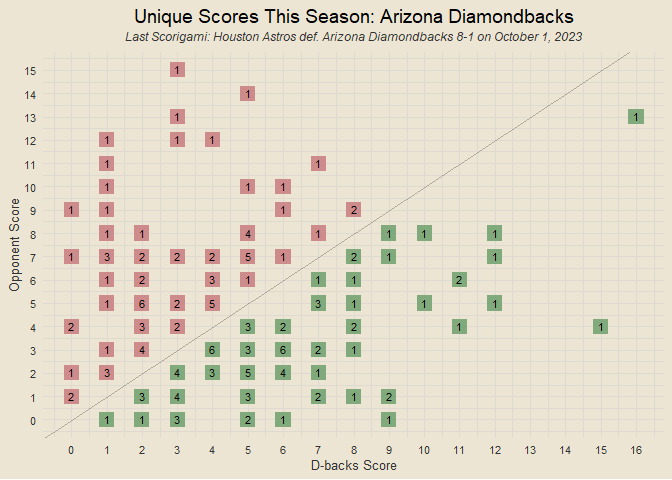<!-- -->

### Atlanta Braves

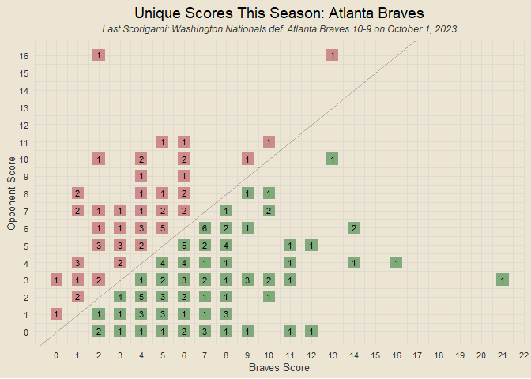<!-- -->

### Baltimore Orioles

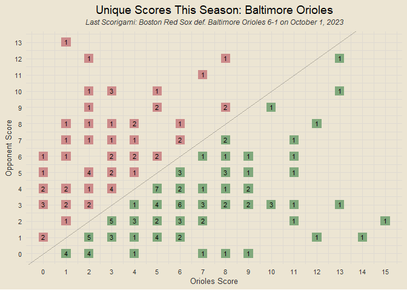<!-- -->

### Boston Red Sox

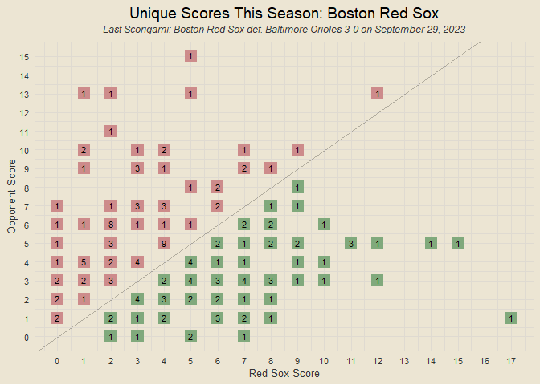<!-- -->

### Chicago Cubs

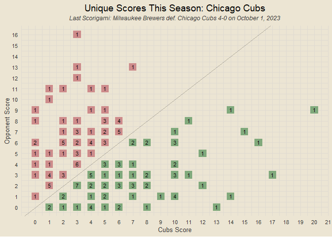<!-- -->

### Chicago White Sox

<!-- -->

### Cincinnati Reds

<!-- -->

### Cleveland Guardians

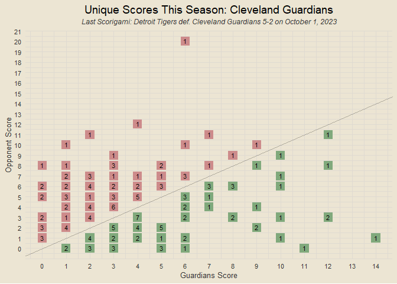<!-- -->

### Colorado Rockies

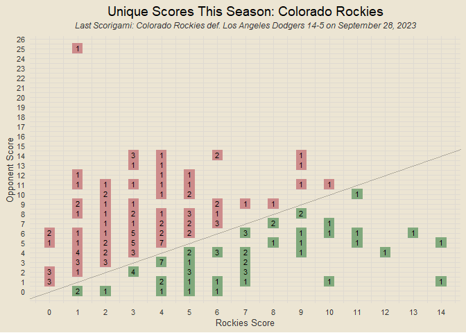<!-- -->

### Detroit Tigers

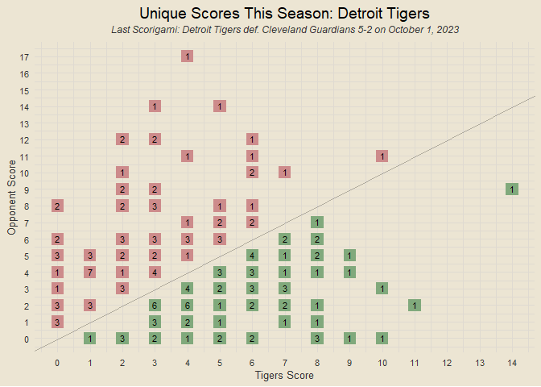<!-- -->

### Houston Astros

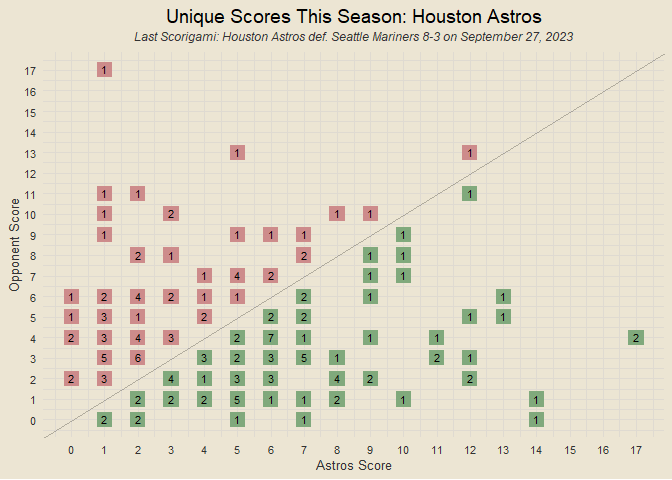<!-- -->

### Kansas City Royals

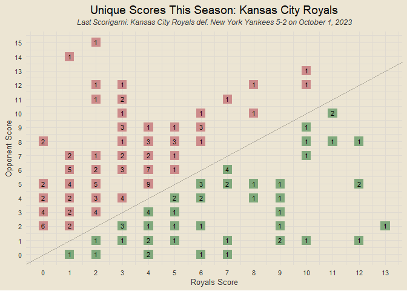<!-- -->

### Los Angeles Angels

<!-- -->

### Los Angeles Dodgers

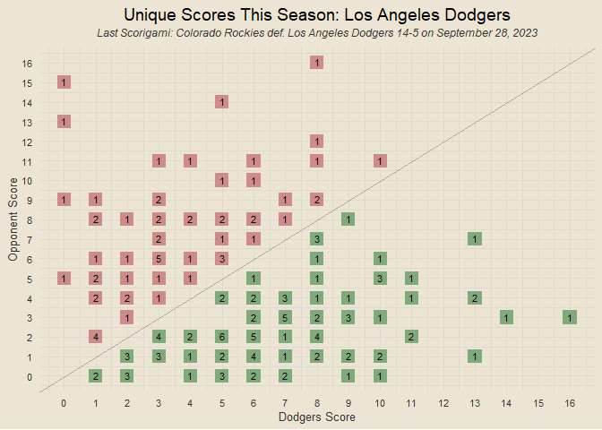<!-- -->

### Miami Marlins

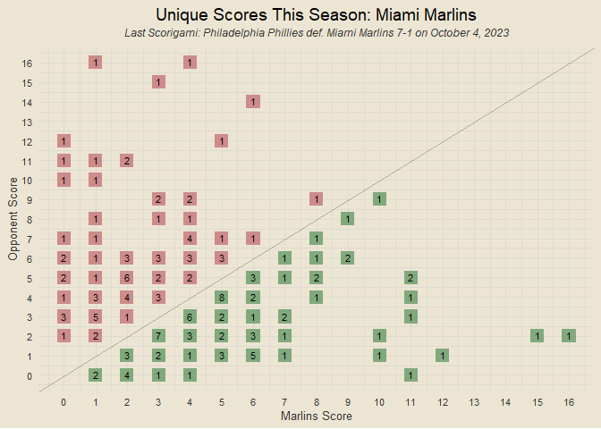<!-- -->

### Milwaukee Brewers

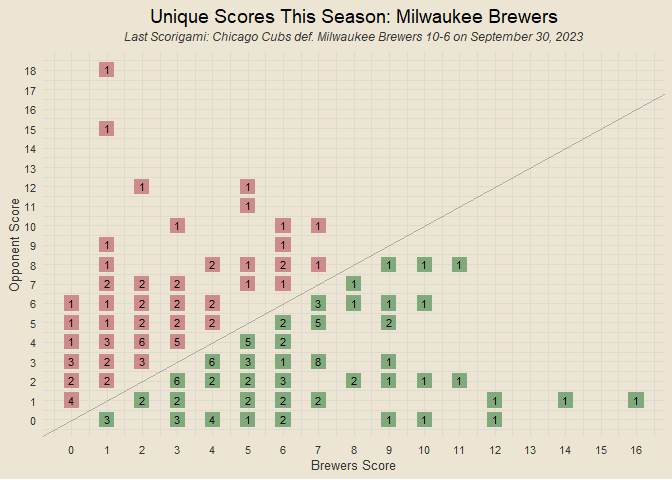<!-- -->

### Minnesota Twins

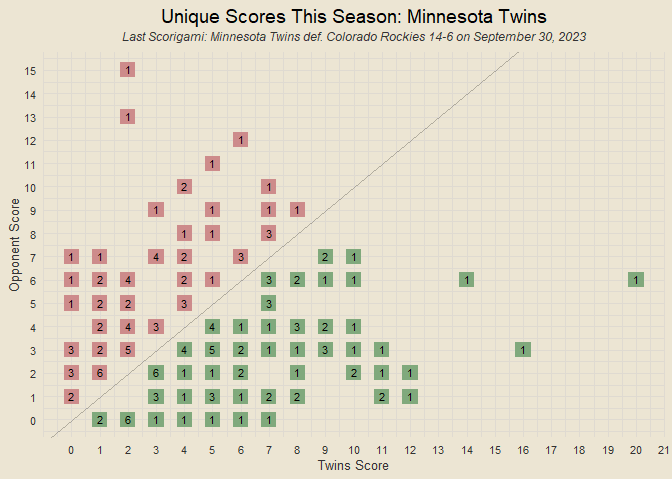<!-- -->

### New York Mets

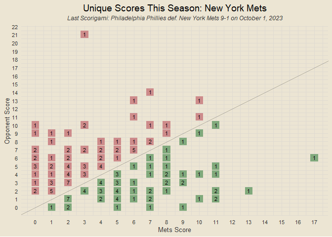<!-- -->

### New York Yankees

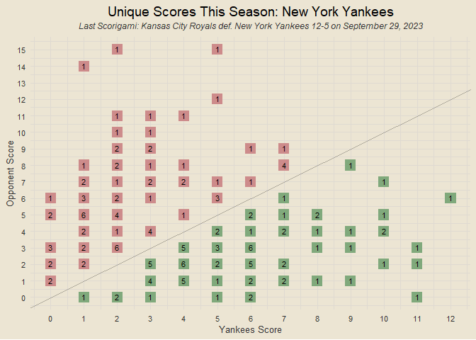<!-- -->

### Oakland Athletics

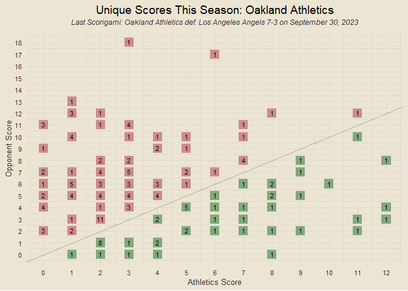<!-- -->

### Philadelphia Phillies

<!-- -->

### Pittsburgh Pirates

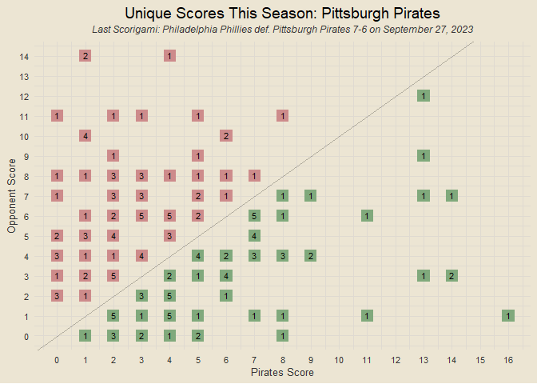<!-- -->

### San Diego Padres

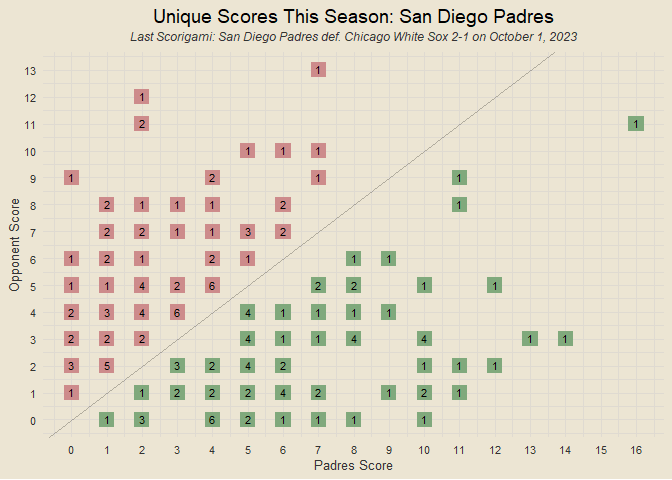<!-- -->

### San Francisco Giants

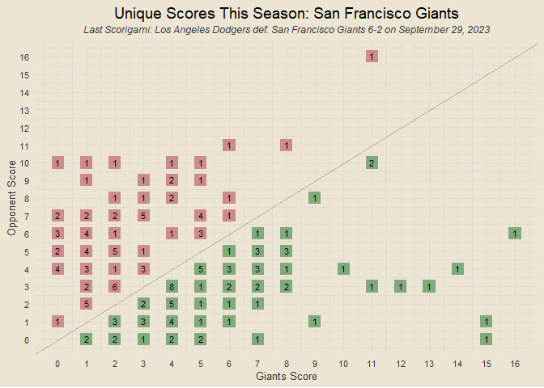<!-- -->

### Seattle Mariners

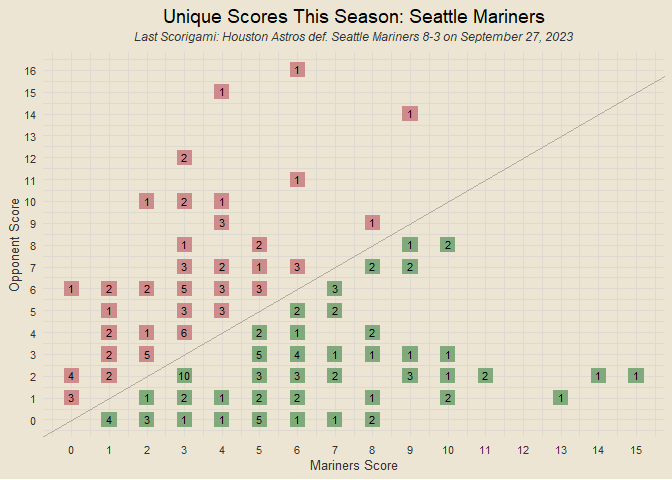<!-- -->

### St. Louis Cardinals

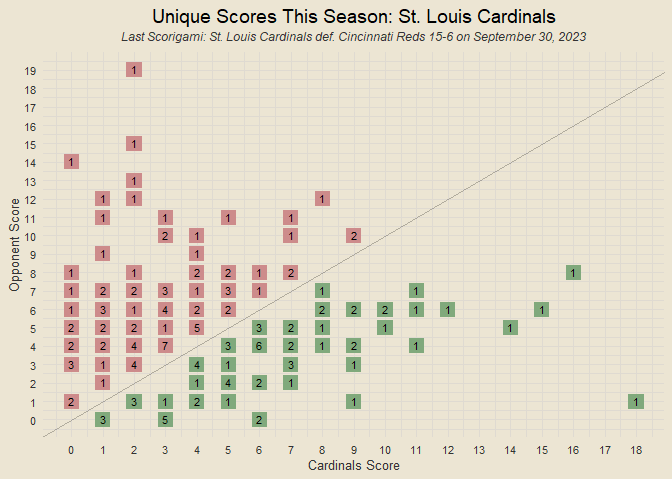<!-- -->

### Tampa Bay Rays

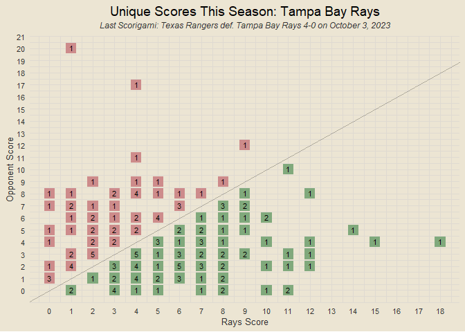<!-- -->

### Texas Rangers

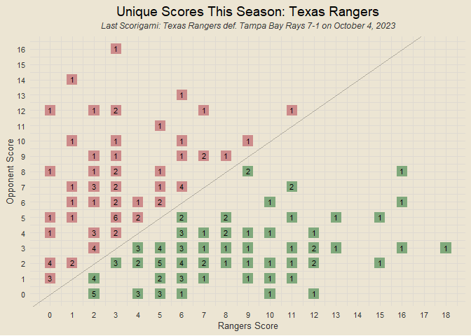<!-- -->

### Toronto Blue Jays

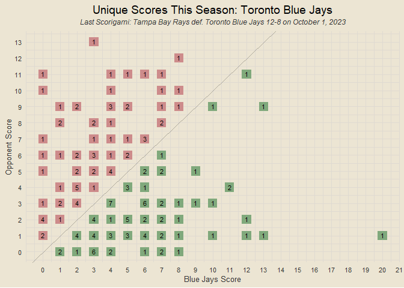<!-- -->

### Washington Nationals

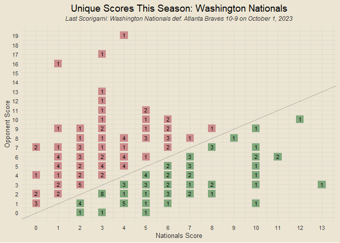<!-- -->
